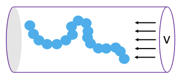
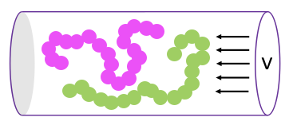

## MD Simulation of Single or Two Polymer Chain(s) in a Nanochannel with Flow

The present repository contains two Jupyter notebooks that each perform a Molecular Dynamics simulation for either one or two polymer chains confined in a nanochannel under a homogenous flow field. The MD simulations are performed using the [ESPResSo](https://espressomd.org) simulation package, which must be installed (see installation guide [here](http://espressomd.org/html/doc/installation.html))

The system supports various channel cross-sections (circular, square, or semi-circular) and simulates the polymer(s) under homogenous flows of tunable strengths along the channel axis. Polymer semiflexibility can be tuned as well via the persistence length parameter. The goal is to analyze polymer conformations, density profiles, and structural properties, and how these contribute to mixing or demixing in the two-chain case. 

Each of the Jupyter notebooks contains codes that generate a simulation run, as well as codes that visualize and analyse the generated data. Sample generated data have also been provided for a quick test of the visualization and analysis tools. 

This work was developed by Lili Zeng during her time as a PhD candidate in the [Reisner lab](https://www.physics.mcgill.ca/~reisner/) at [McGill University](https://www.mcgill.ca/). Her full PhD thesis can be viewed [here](https://escholarship.mcgill.ca/concern/theses/v405sh31w). If you have any questions/issues with the code in this repository, feel free to reach out at *lili.zeng@mail.mcgill.ca*.

## Files in this distribution
- **Simulate\_Polymer\_in\_Channel.ipynb**: Jupyter notebook that simulates and analyzes a single polymer chain in a channel under flow.
- **Positions\_N150\_p10\_circular\_v0-05.h5**: H5md data file containing a single chain simulation run with 150 monomers, chain persistence length of 10, circular channel geometry, and flow speed of 0.05. The simulation length was 100,000 timesteps. The file can be opened in Simulate\_Polymer\_in\_Channel.ipynb in the Part 2 section.
- **Chain\_edges\_N150\_p10\_circular\_v0-05.txt**: Text file containing the max and min monomer positions along the channel axis, effectively corresponding to the chain edges along the channel. Can be opened in Simulate\_Polymer\_in\_Channel.ipynb in the Part 2 section as well.
- **Simulate\_Two\_Polymer\_in\_Channel.ipynb**: Jupyter notebook that simulates and analyzes two polymer chains in a channel under flow.
- **Positions\_n2\_N150\_p2-4\_circular\_v0-05.h5**: H5md data file containing a two-polymer-chain simulation run with 150 monomers each, chain persistence length of 2.4, circular channel geometry, and flow speed of 0.05. The simulation length was 100,000 timesteps. The file can be opened in Simulate\_Two\_Polymer\_in\_Channel.ipynb in the Part 2 section.
- **Chain\_edges\_n2\_N150\_p2-4\_circular\_v0-05.txt**: Text file containing the max and min monomer positions of each of the two chains along the channel axis, effectively corresponding to the edges of each chain along the channel. Can be opened in Simulate\_Two\_Polymer\_in\_Channel.ipynb in the Part 2 section as well.
